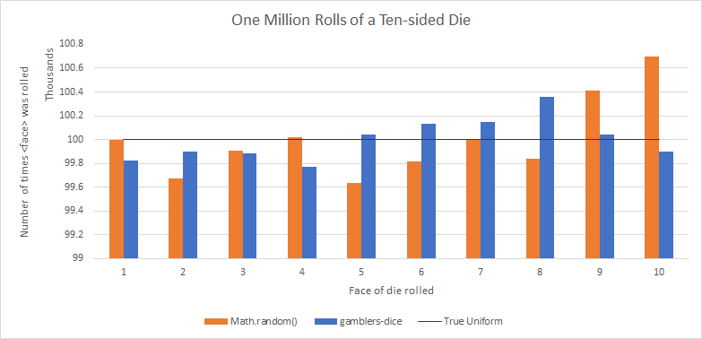

# The Gambler's Fallacy Dice

> The term *Gambler's fallacy* refers to a misconception about statistics. [...]
In statistics, a random event has a certain probability of occurring. The
fallacy is that if the event has occurred less frequently in the past, it
will be more frequent in the future.
-[Wikipedia](https://simple.wikipedia.org/wiki/Gambler%27s_fallacy)

Well no longer is this a fallacy my friends, these dice are real! If you roll a
20 sided die, and you haven't seen a 20 in a while it is **statistically more
likely** to show up in the next roll with these dice. And the best part, it's
still *uniformly random* for large sample sets!

obligatory chart


## How to Use

```bash
$ npm install --save gamblers-dice
```

```javascript
const RiggedDie = require('gamblers-dice')
const die = new RiggedDie(20) // for a d20

console.log(die.roll()) // 1 -> 20
```
